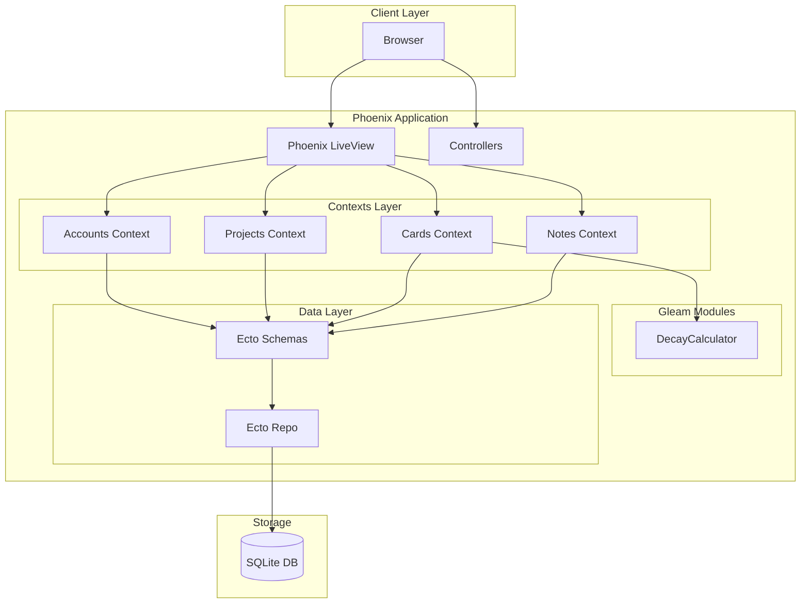
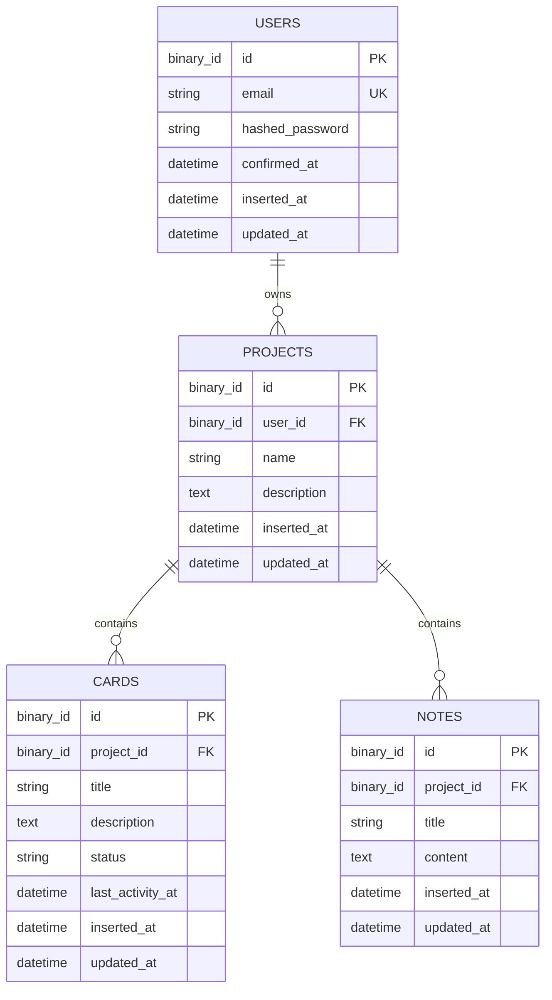

# ExoBrain Design Document

## Overview

ExoBrain is a personal productivity application built with Elixir/Phoenix that combines task management with a knowledge base. The system uses a modern tech stack featuring Phoenix 1.8.3+ with LiveView for real-time UI, Gleam for business logic modules (specifically the decay calculator), SQLite for lightweight persistence, and Kamal for deployment.

The architecture follows Phoenix conventions with Contexts for data access, Ecto schemas for database modeling, and a clear separation between Elixir orchestration code and Gleam business logic.

## Architecture



## Components and Interfaces

### 1. Phoenix Application Structure

```
exobrain/
├── config/
│   ├── config.exs
│   ├── dev.exs
│   ├── prod.exs
│   ├── runtime.exs
│   └── test.exs
├── lib/
│   ├── exobrain/
│   │   ├── accounts/           # User authentication context
│   │   │   ├── user.ex
│   │   │   └── user_token.ex
│   │   ├── accounts.ex
│   │   ├── projects/           # Projects context
│   │   │   └── project.ex
│   │   ├── projects.ex
│   │   ├── cards/              # Cards context
│   │   │   └── card.ex
│   │   ├── cards.ex
│   │   ├── notes/              # Notes context
│   │   │   └── note.ex
│   │   ├── notes.ex
│   │   ├── application.ex
│   │   ├── repo.ex
│   │   └── mailer.ex
│   └── exobrain_web/
│       ├── components/
│       ├── controllers/
│       ├── live/
│       ├── endpoint.ex
│       └── router.ex
├── priv/
│   ├── repo/
│   │   └── migrations/
│   └── static/
├── src/                        # Gleam source files
│   └── decay_calculator.gleam
├── test/
├── gleam.toml
├── mix.exs
└── deploy.yml                  # Kamal configuration
```

### 2. Gleam Integration

The project uses `mix_gleam` to compile Gleam modules alongside Elixir. Gleam files in `src/` are compiled to BEAM bytecode and callable from Elixir using the `:module_name` atom syntax.

**Interop Pattern (Primitive Types Only):**

To avoid complexity with Elixir struct serialization, the Gleam interface uses Unix timestamps (integers) instead of DateTime structs:

```elixir
# Calling Gleam from Elixir - convert DateTime to Unix timestamp first
unix_timestamp = DateTime.to_unix(last_activity_at)
health_status = :decay_calculator.calculate_health(unix_timestamp)
```

```gleam
// Gleam function signature - accepts Int (Unix timestamp in seconds)
pub fn calculate_health(last_activity_unix: Int) -> String
```

This approach:
- Simplifies cross-language data exchange
- Avoids serialization issues with complex types
- Uses universally understood Unix timestamps

### 3. Context Interfaces

#### Accounts Context (phx.gen.auth)
- `get_user!/1` - Fetch user by ID
- `get_user_by_email/1` - Fetch user by email
- `register_user/1` - Create new user
- `authenticate_user/2` - Validate credentials
- `generate_user_session_token/1` - Create session
- `delete_user_session_token/1` - Destroy session

#### Projects Context
- `list_projects/1` - List user's projects
- `get_project!/2` - Get project by ID (scoped to user)
- `create_project/2` - Create project for user
- `update_project/2` - Update project attributes
- `delete_project/1` - Delete project (cascades)

#### Cards Context
- `list_cards/1` - List cards for a project
- `get_card!/1` - Get card by ID
- `create_card/2` - Create card in project
- `update_card/2` - Update card attributes
- `update_card_status/2` - Change status (updates last_activity_at)
- `delete_card/1` - Delete card
- `get_card_health/1` - Call Gleam DecayCalculator

#### Notes Context
- `list_notes/1` - List notes for a project
- `get_note!/1` - Get note by ID
- `create_note/2` - Create note in project
- `update_note/2` - Update note attributes
- `delete_note/1` - Delete note

## Data Models

### Entity Relationship Diagram



### Schema Definitions

#### User Schema
| Field | Type | Constraints |
|-------|------|-------------|
| id | binary_id | Primary key |
| email | string | Unique, required |
| hashed_password | string | Required |
| confirmed_at | utc_datetime | Nullable |
| inserted_at | utc_datetime | Auto |
| updated_at | utc_datetime | Auto |

#### Project Schema
| Field | Type | Constraints |
|-------|------|-------------|
| id | binary_id | Primary key |
| user_id | binary_id | Foreign key (users), on_delete: delete_all |
| name | string | Required, max 255 |
| description | text | Nullable |
| inserted_at | utc_datetime | Auto |
| updated_at | utc_datetime | Auto |

#### Card Schema
| Field | Type | Constraints |
|-------|------|-------------|
| id | binary_id | Primary key |
| project_id | binary_id | Foreign key (projects), on_delete: delete_all |
| title | string | Required, max 255 |
| description | text | Nullable |
| status | string | Required, enum: ["todo", "in_progress", "done"] |
| last_activity_at | utc_datetime | Required, defaults to inserted_at |
| inserted_at | utc_datetime | Auto |
| updated_at | utc_datetime | Auto |

#### Note Schema
| Field | Type | Constraints |
|-------|------|-------------|
| id | binary_id | Primary key |
| project_id | binary_id | Foreign key (projects), on_delete: delete_all |
| title | string | Required, max 255 |
| content | text | Nullable |
| inserted_at | utc_datetime | Auto |
| updated_at | utc_datetime | Auto |

### Card Status Enum
- `todo` - Task not started
- `in_progress` - Task being worked on
- `done` - Task completed

### Decay Health Status (Gleam)
- `Fresh` - Activity within last 24 hours
- `Stale` - Activity between 24 hours and 7 days ago
- `Rotten` - No activity for more than 7 days

## Deployment Architecture

### Kamal Configuration with SQLite Persistence

Since SQLite stores data in a file inside the container, Docker volumes are required to persist data across deployments.

```yaml
# deploy.yml structure
volumes:
  - /var/exobrain-data:/app/priv/data
```

**Volume Mapping:**
- Host path: `/var/exobrain-data` (created on VPS)
- Container path: `/app/priv/data` (where SQLite DB lives)

**Database Path Configuration:**
```elixir
# config/runtime.exs
database_path = 
  System.get_env("DATABASE_PATH") || 
  Path.join(Application.app_dir(:exobrain, "priv"), "data/exobrain.db")
```

This ensures:
- Data survives container restarts and redeployments
- Backups can be performed on the host filesystem
- No data loss during `kamal deploy`


## Correctness Properties

*A property is a characteristic or behavior that should hold true across all valid executions of a system-essentially, a formal statement about what the system should do. Properties serve as the bridge between human-readable specifications and machine-verifiable correctness guarantees.*

### Property 1: Password Hashing on Registration
*For any* valid email and password combination, when a user registers, the stored password SHALL be a hash (not plaintext) and SHALL NOT equal the original password.
**Validates: Requirements 2.1**

### Property 2: Authentication Success with Valid Credentials
*For any* registered user, when authenticating with the correct email and password, the system SHALL return a valid session token.
**Validates: Requirements 2.2**

### Property 3: Authentication Failure with Invalid Credentials
*For any* registered user and any password that differs from their actual password, authentication SHALL fail and return an error.
**Validates: Requirements 2.3**

### Property 4: Session Invalidation on Logout
*For any* authenticated session, after logout, the session token SHALL no longer be valid for accessing protected resources.
**Validates: Requirements 2.4**

### Property 5: Project Scoping to User
*For any* user with projects, listing projects SHALL return only projects where user_id matches the requesting user, and SHALL NOT include projects belonging to other users.
**Validates: Requirements 3.2**

### Property 6: Project Cascade Delete
*For any* project with associated cards and notes, when the project is deleted, all associated cards and notes SHALL also be deleted from the database.
**Validates: Requirements 3.4, 6.6**

### Property 7: Card Default Status
*For any* card created without an explicit status, the status SHALL default to "todo" and last_activity_at SHALL be set to the creation timestamp.
**Validates: Requirements 4.1, 4.5**

### Property 8: Card Status Change Updates Activity Timestamp
*For any* card, when the status is changed to a different value, last_activity_at SHALL be updated to the current timestamp.
**Validates: Requirements 4.2, 4.6**

### Property 9: Card Non-Status Update Preserves Activity Timestamp
*For any* card, when updated without changing the status field, last_activity_at SHALL remain unchanged.
**Validates: Requirements 4.7**

### Property 10: Card Scoping to Project
*For any* project, listing cards SHALL return only cards where project_id matches the specified project.
**Validates: Requirements 4.3**

### Property 11: Note Scoping to Project
*For any* project, listing notes SHALL return only notes where project_id matches the specified project.
**Validates: Requirements 5.3**

### Property 12: User Cascade Delete
*For any* user with projects, cards, and notes, when the user is deleted, all associated projects, cards, and notes SHALL be deleted.
**Validates: Requirements 6.5**

### Property 13: DecayCalculator Health Status Boundaries
*For any* Unix timestamp (integer seconds), the DecayCalculator SHALL return:
- "Fresh" when elapsed time is less than 24 hours (86400 seconds)
- "Stale" when elapsed time is between 24 hours and 7 days (86400-604800 seconds)
- "Rotten" when elapsed time exceeds 7 days (>604800 seconds)
**Validates: Requirements 7.2, 7.3**

### Property 14: Context Validation Error Handling
*For any* invalid input to a context function (e.g., missing required fields, invalid format), the function SHALL return `{:error, changeset}` where changeset contains descriptive error messages.
**Validates: Requirements 9.4**

## Error Handling

### Database Errors
- **Constraint Violations**: Return `{:error, changeset}` with field-specific error messages
- **Not Found**: Raise `Ecto.NoResultsError` for `get!/1` functions, return `nil` for `get/1`
- **Connection Errors**: Let Phoenix handle with appropriate 500 response

### Authentication Errors
- **Invalid Credentials**: Return `{:error, :invalid_credentials}` without revealing which field is wrong
- **Session Expired**: Redirect to login with flash message
- **Unauthorized Access**: Return 401/403 status or redirect based on request type

### Validation Errors
- **Missing Required Fields**: Include in changeset errors with "can't be blank" message
- **Invalid Format**: Include specific format requirements in error message
- **Invalid Status**: Reject with "is invalid" for status not in enum

### Gleam Interop Errors
- **Invalid Timestamp**: DecayCalculator should handle edge cases gracefully
- **Nil Input**: Return a default status or raise clear error

## Testing Strategy

### Testing Framework
- **ExUnit**: Built-in Elixir testing framework for unit and integration tests
- **StreamData**: Property-based testing library for Elixir (similar to PropTest)

### Unit Tests
Unit tests will cover:
- Schema validations and changesets
- Context function behavior with specific examples
- Edge cases (empty strings, nil values, boundary conditions)
- Error conditions and validation failures

### Property-Based Tests
Property-based tests will verify universal properties using StreamData:

Each property test MUST:
1. Be tagged with a comment: `# **Feature: exobrain, Property {number}: {property_text}**`
2. Run a minimum of 100 iterations
3. Use generators that produce valid domain data

**Generator Strategy:**
- `StreamData.string(:alphanumeric)` for names/titles
- `StreamData.string(:printable)` for descriptions/content
- Custom generators for emails, timestamps, and status enums

### Test Organization
```
test/
├── exobrain/
│   ├── accounts_test.exs          # Accounts context unit tests
│   ├── projects_test.exs          # Projects context unit tests
│   ├── cards_test.exs             # Cards context unit tests
│   ├── notes_test.exs             # Notes context unit tests
│   └── decay_calculator_test.exs  # Gleam interop tests
├── exobrain_web/
│   ├── controllers/               # Controller tests
│   └── live/                      # LiveView tests
├── support/
│   ├── fixtures/                  # Test fixtures
│   ├── generators.ex              # StreamData generators
│   └── data_case.ex               # Database test case
└── properties/
    ├── accounts_properties_test.exs
    ├── projects_properties_test.exs
    ├── cards_properties_test.exs
    ├── notes_properties_test.exs
    └── decay_calculator_properties_test.exs
```

### Property Test Examples

```elixir
# test/properties/cards_properties_test.exs

# **Feature: exobrain, Property 8: Card Status Change Updates Activity Timestamp**
property "status change updates last_activity_at" do
  check all status <- member_of(["todo", "in_progress", "done"]),
            new_status <- member_of(["todo", "in_progress", "done"]),
            status != new_status do
    # Create card with initial status
    # Update to new_status
    # Assert last_activity_at changed
  end
end

# **Feature: exobrain, Property 13: DecayCalculator Health Status Boundaries**
property "decay calculator returns correct health status" do
  check all seconds_ago <- integer(0..1_000_000) do
    now_unix = DateTime.to_unix(DateTime.utc_now())
    timestamp_unix = now_unix - seconds_ago
    health = :decay_calculator.calculate_health(timestamp_unix)
    
    cond do
      seconds_ago < 86_400 -> assert health == "Fresh"      # < 24 hours
      seconds_ago < 604_800 -> assert health == "Stale"     # < 7 days
      true -> assert health == "Rotten"
    end
  end
end
```

### Integration Tests
- Authentication flow (register → login → access → logout)
- CRUD operations through LiveView
- Cascade delete verification
- Gleam-Elixir interop in context of card display
