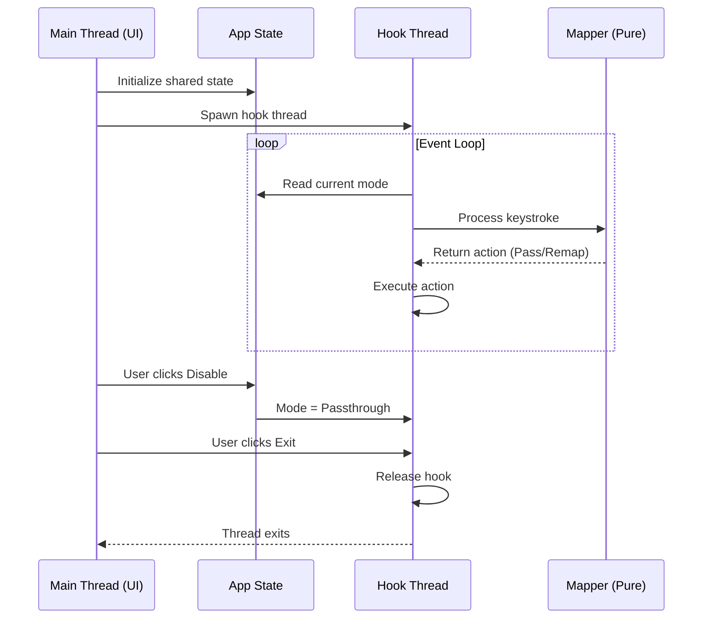

# Design Document: GhostKeys

## Overview

GhostKeys is a Windows System Tray application that intercepts keyboard input at the system level to provide ABNT2 (Brazilian) keyboard layout emulation on US keyboards. The application maps physical key positions from US layout to their ABNT2 equivalents, allowing users with ABNT2 muscle memory to type Portuguese naturally on US hardware.

**Key Concept:** This is NOT US-International dead-key behavior. GhostKeys maps **ABNT2 physical key positions** to their pt-BR meanings. When a user presses `;` on a US keyboard, GhostKeys outputs `ç` because that's where the cedilla key is on ABNT2.

**Prerequisite:** The system must have Windows configured with the **English (US)** keyboard layout (not US-International).

The design prioritizes:
- Low latency (<10ms) keystroke processing
- Panic safety with guaranteed hook release
- Clean separation between UI, hook, and mapping logic
- Thread-safe communication between components

## Architecture

GhostKeys follows a multi-threaded architecture with clear separation of concerns and platform abstraction:

```
┌─────────────────────────────────────────────────────────────────┐
│                         Main Thread                              │
│  ┌─────────────┐    ┌──────────────┐                            │
│  │  Tray Icon  │◄──►│  Event Loop  │                            │
│  │  (tray-icon)│    │    (tao)     │                            │
│  └─────────────┘    └──────────────┘                            │
│         │                  │                                     │
│         └──────────────────┘                                     │
│                            │                                     │
│                    ┌───────▼───────┐                            │
│                    │  App State    │                            │
│                    │ (Arc<Mutex>)  │                            │
│                    └───────┬───────┘                            │
└────────────────────────────┼────────────────────────────────────┘
                             │
              ┌──────────────┼──────────────┐
              │              │              │
              ▼              ▼              ▼
┌─────────────────┐  ┌─────────────┐  ┌─────────────────┐
│  Hook Thread    │  │   Mapper    │  │  Panic Handler  │
│  (platform/)    │  │   (pure)    │  │   (global)      │
│                 │  │             │  │                 │
│  - Trait impl   │  │ - Position  │  │ - Hook release  │
│  - Key events   │  │   Map       │  │ - Cleanup       │
│  - Inject keys  │  │ - State     │  │                 │
│                 │  │   Machine   │  │                 │
└─────────────────┘  └─────────────┘  └─────────────────┘
```

### Project Structure

```
src/
├── main.rs              # Entry point, platform detection
├── mapper.rs            # Pure logic - testable on any OS
├── state.rs             # Shared state types - pure Rust
├── error.rs             # Error types - pure Rust
├── interceptor.rs       # Trait definition for keyboard hook
└── platform/
    ├── mod.rs           # Platform detection and factory
    ├── windows.rs       # Windows implementation (primary)
    └── linux.rs         # Linux implementation (dev/testing)
```

**Platform Abstraction Benefits:**
- Core mapper logic is pure Rust, testable on any OS
- Property-based tests run on Linux during development
- Only `platform/` code requires target OS for integration testing
- Easy to add macOS support later

### Threading Model



## Components and Interfaces

### 1. Main Entry Point (`main.rs`)

Responsibilities:
- Initialize the application and shared state
- Set up the System Tray icon and menu
- Run the event loop using `tao`
- Coordinate shutdown sequence

```rust
pub struct AppState {
    pub mode: OperationMode,
    pub should_exit: bool,
}

pub enum OperationMode {
    Active,
    Passthrough,
}
```

### 2. Keyboard Interceptor (`interceptor.rs` + `platform/`)

The interceptor is split into a trait definition and platform-specific implementations.

**Trait Definition (`interceptor.rs`):**

```rust
pub trait KeyboardInterceptor: Send {
    fn start(&mut self, state: Arc<Mutex<AppState>>) -> Result<(), InterceptorError>;
    fn stop(&mut self) -> Result<(), InterceptorError>;
    fn is_running(&self) -> bool;
}

pub enum KeyAction {
    Pass,                       // Allow keystroke through
    Suppress,                   // Block the keystroke (dead key pending)
    Replace(char),              // Suppress and inject replacement
    ReplaceMultiple(Vec<char>), // Suppress and inject multiple chars
}

/// Factory function to create platform-specific interceptor
pub fn create_interceptor() -> Box<dyn KeyboardInterceptor>;
```

**Platform Implementations:**

`platform/windows.rs` - Primary target (Windows 11):
- Uses `windows-rs` (Microsoft official bindings) for keyboard hooks
- Implements `SetWindowsHookEx` (WH_KEYBOARD_LL) for key interception
- Uses `SendInput` for key injection
- Production-ready, security-auditable

`platform/linux.rs` - Development/testing:
- Uses `rdev` with X11/Wayland support
- Allows running and testing on Linux during development
- Same interface, different backend
- NOT for production use

Responsibilities:
- Install and manage the low-level keyboard hook
- Read shared state to determine current mode
- Delegate keystroke processing to the Mapper
- Inject replacement characters when needed
- Guarantee hook release on panic or shutdown

### 3. Mapper (`mapper.rs`)

Responsibilities:
- Implement ABNT2 position-based character mapping
- Implement the dead key state machine
- Process keystrokes and return appropriate actions
- Handle timeout for pending accents

```rust
pub enum MapperState {
    Idle,
    PendingAccent(AccentType),
}

pub enum AccentType {
    Tilde,      // ' key on US → ~ dead key on ABNT2
    Acute,      // [ key on US → ´ dead key on ABNT2
    Grave,      // ] key on US → ` dead key on ABNT2
    Circumflex, // Shift+[ on US → ^ dead key on ABNT2
}

pub struct Mapper {
    state: MapperState,
    last_accent_time: Option<Instant>,
    position_map: HashMap<VirtualKey, char>,
    accent_combinations: HashMap<(AccentType, char), char>,
}

impl Mapper {
    pub fn new() -> Self;
    pub fn process_key(&mut self, key: VirtualKey, shift: bool) -> KeyAction;
    pub fn check_timeout(&mut self) -> Option<KeyAction>;
    pub fn reset(&mut self);
}
```

**ABNT2 Position Mapping Table (US Key → ABNT2 Output):**

| US Key | Unshifted Output | Shifted Output | Notes |
|--------|------------------|----------------|-------|
| `;`    | `ç`              | `Ç`            | Cedilla (direct) |
| `` ` ``| `"`              | `"`            | Quote (ABNT2 position) |
| `'`    | *dead key*       | *dead key*     | Tilde accent |
| `[`    | *dead key*       | *dead key*     | Acute accent |
| `]`    | *dead key*       | *dead key*     | Grave accent |
| `\`    | `]`              | `}`            | Right bracket |

**Accent Combination Table:**

| Accent | + Char | = Output |
|--------|--------|----------|
| Tilde  | `a`    | `ã`      |
| Tilde  | `A`    | `Ã`      |
| Tilde  | `o`    | `õ`      |
| Tilde  | `O`    | `Õ`      |
| Tilde  | `n`    | `ñ`      |
| Tilde  | `N`    | `Ñ`      |
| Acute  | `a`    | `á`      |
| Acute  | `A`    | `Á`      |
| Acute  | `e`    | `é`      |
| Acute  | `E`    | `É`      |
| Acute  | `i`    | `í`      |
| Acute  | `I`    | `Í`      |
| Acute  | `o`    | `ó`      |
| Acute  | `O`    | `Ó`      |
| Acute  | `u`    | `ú`      |
| Acute  | `U`    | `Ú`      |
| Grave  | `a`    | `à`      |
| Grave  | `A`    | `À`      |

## Data Models

### Shared State

```rust
use std::sync::{Arc, Mutex};
use std::sync::atomic::{AtomicBool, Ordering};

pub struct SharedState {
    inner: Arc<Mutex<AppState>>,
    exit_flag: Arc<AtomicBool>,
}

impl SharedState {
    pub fn new() -> Self;
    pub fn get_mode(&self) -> OperationMode;
    pub fn set_mode(&self, mode: OperationMode);
    pub fn signal_exit(&self);
    pub fn should_exit(&self) -> bool;
}
```

### Event Types

```rust
pub enum TrayMenuAction {
    ToggleMode,
    Exit,
}
```


## Correctness Properties

*A property is a characteristic or behavior that should hold true across all valid executions of a system-essentially, a formal statement about what the system should do. Properties serve as the bridge between human-readable specifications and machine-verifiable correctness guarantees.*

Based on the prework analysis, the following correctness properties have been identified:

### Property 1: Position Mapping Correctness

*For any* US key that has a direct ABNT2 position mapping (`;`, `` ` ``, `\`), when the Mapper processes that key in Idle state, the Mapper SHALL return a Replace action with the correct ABNT2 character, respecting shift state.

**Validates: Requirements 1.1, 1.2, 1.3, 1.4, 1.8**

### Property 2: Dead Key Trigger Transition

*For any* dead key trigger key (`'`, `[`, `]`) pressed when the Mapper is in Idle state, the Mapper SHALL transition to PendingAccent state with the correct accent type and return a Suppress action.

**Validates: Requirements 1.5, 1.6, 1.7, 3.2**

### Property 3: Dead Key Combination Correctness

*For any* valid accent type and combinable character pair from the accent combination table, when the Mapper is in PendingAccent state and processes that character, the Mapper SHALL return a Replace action with the correct accented character and transition to Idle state.

**Validates: Requirements 2.1, 2.2, 2.3, 2.4, 2.5, 2.6, 2.7, 2.8, 2.9, 2.10, 2.11, 3.3**

### Property 4: Non-Combinable Character Fallback

*For any* accent type and non-combinable character (not in the combination table), when the Mapper is in PendingAccent state and processes that character, the Mapper SHALL return a ReplaceMultiple action containing the accent character followed by the pressed character, and transition to Idle state.

**Validates: Requirements 2.12, 2.13, 3.4**

### Property 5: State Machine Timeout Behavior

*For any* Mapper in PendingAccent state, if 500 milliseconds elapse without a keystroke, the Mapper SHALL output the stored accent character and transition to Idle state.

**Validates: Requirements 3.5**

### Property 6: Enable/Disable Toggle Round-Trip

*For any* SharedState, toggling mode twice (Disable then Enable) SHALL restore the state to Active mode.

**Validates: Requirements 4.3, 4.4**

### Property 7: Passthrough Mode Transparency

*For any* keystroke when the application is in Passthrough mode, the Interceptor SHALL return a Pass action without modifying the keystroke.

**Validates: Requirements 7.3**

### Property 8: Keystroke Processing Latency

*For any* keystroke processed by the Mapper, the processing time SHALL be less than 10 milliseconds.

**Validates: Requirements 5.1**

## Error Handling

### Panic Safety Strategy

```rust
// Global panic handler setup in main.rs
fn setup_panic_handler(hook_handle: Arc<Mutex<Option<HookHandle>>>) {
    let original_hook = std::panic::take_hook();
    std::panic::set_hook(Box::new(move |panic_info| {
        // Release keyboard hook immediately
        if let Ok(mut handle) = hook_handle.lock() {
            if let Some(h) = handle.take() {
                let _ = h.release();
            }
        }
        // Call original panic handler
        original_hook(panic_info);
    }));
}
```

### Error Types

```rust
#[derive(Debug, thiserror::Error)]
pub enum GhostKeysError {
    #[error("Failed to install keyboard hook: {0}")]
    HookInstallError(String),
    
    #[error("Failed to release keyboard hook: {0}")]
    HookReleaseError(String),
    
    #[error("Tray icon error: {0}")]
    TrayError(String),
    
    #[error("State lock poisoned")]
    StateLockPoisoned,
}
```

### Recovery Strategies

| Error Type | Recovery Strategy |
|------------|-------------------|
| Hook install failure | Log error, show tray notification, exit gracefully |
| State lock poisoned | Release hook, terminate application |
| Tray icon failure | Continue without tray (headless mode) |

## Testing Strategy

### Property-Based Testing

GhostKeys will use the `proptest` crate for property-based testing. Each correctness property will be implemented as a property-based test with a minimum of 100 iterations.

**Test Configuration:**
```rust
proptest! {
    #![proptest_config(ProptestConfig::with_cases(100))]
    
    // Property tests here
}
```

**Generator Strategies:**

1. **Position Key Generator**: Generates random keys from the set {`;`, `` ` ``, `\`} with random shift state
2. **Dead Key Trigger Generator**: Generates random keys from the set {`'`, `[`, `]`}
3. **Character Generator**: Generates random ASCII characters, with weighted distribution toward combinable characters
4. **Keystroke Sequence Generator**: Generates sequences of keystrokes for state machine testing

### Unit Tests

Unit tests will cover:
- Individual character mappings (specific examples)
- State machine edge cases (empty input, rapid key presses)
- Error handling paths
- Timeout boundary conditions

### Integration Tests

Integration tests will verify:
- Hook installation and release on Windows
- Tray icon creation and menu interaction
- End-to-end keystroke processing (manual verification)

### Test File Structure

```
src/
├── mapper.rs                 # Contains unit tests (#[cfg(test)])
├── state.rs                  # Contains unit tests (#[cfg(test)])
tests/
├── mapper_properties.rs      # Property tests for Mapper (runs on any OS)
├── state_machine_tests.rs    # Unit tests for state transitions (runs on any OS)
├── integration_tests.rs      # Integration tests (platform-specific)
```

**Cross-Platform Testing Strategy:**
- Property tests (Properties 1-5, 8) run on any OS - they test pure mapper logic
- State tests (Property 6) run on any OS - they test pure state logic
- Integration tests (Property 7) are platform-specific - they test actual hook behavior
- Development on Linux: run `cargo test` for all pure logic tests
- Final validation on Windows: run full integration tests

### Test Annotations

All property-based tests must include the following annotation format:
```rust
// **Feature: ghostkeys, Property 1: Position Mapping Correctness**
// **Validates: Requirements 1.1, 1.2, 1.3, 1.4, 1.8**
```
