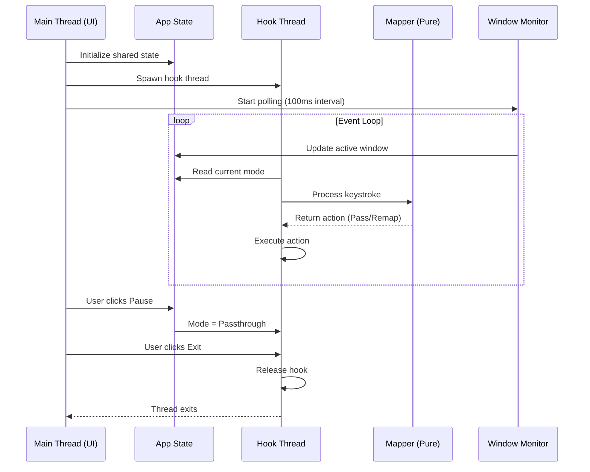

# Design Document: GhostKeys

## Overview

GhostKeys is a Windows System Tray application that intercepts keyboard input at the system level to provide ABNT2 (Brazilian) keyboard layout emulation on US-International keyboards. The application uses a state machine to handle dead key sequences and provides context-aware remapping based on the active window.

The design prioritizes:
- Low latency (<10ms) keystroke processing
- Panic safety with guaranteed hook release
- Clean separation between UI, hook, and mapping logic
- Thread-safe communication between components

## Architecture

GhostKeys follows a multi-threaded architecture with clear separation of concerns:

```
┌─────────────────────────────────────────────────────────────────┐
│                         Main Thread                              │
│  ┌─────────────┐    ┌──────────────┐    ┌───────────────────┐  │
│  │  Tray Icon  │◄──►│  Event Loop  │◄──►│  Window Monitor   │  │
│  │  (tray-icon)│    │    (tao)     │    │(active-win-pos-rs)│  │
│  └─────────────┘    └──────────────┘    └───────────────────┘  │
│         │                  │                      │             │
│         └──────────────────┼──────────────────────┘             │
│                            │                                     │
│                    ┌───────▼───────┐                            │
│                    │  App State    │                            │
│                    │ (Arc<Mutex>)  │                            │
│                    └───────┬───────┘                            │
└────────────────────────────┼────────────────────────────────────┘
                             │
              ┌──────────────┼──────────────┐
              │              │              │
              ▼              ▼              ▼
┌─────────────────┐  ┌─────────────┐  ┌─────────────────┐
│  Hook Thread    │  │   Mapper    │  │  Panic Handler  │
│  (interceptor)  │  │   (pure)    │  │   (global)      │
│                 │  │             │  │                 │
│  - rdev hook    │  │ - State     │  │ - Hook release  │
│  - Key events   │  │   Machine   │  │ - Cleanup       │
│  - Inject keys  │  │ - Char map  │  │                 │
└─────────────────┘  └─────────────┘  └─────────────────┘
```

### Threading Model



## Components and Interfaces

### 1. Main Entry Point (`main.rs`)

Responsibilities:
- Initialize the application and shared state
- Set up the System Tray icon and menu
- Run the event loop using `tao`
- Coordinate shutdown sequence

```rust
// Key structures
pub struct AppState {
    pub mode: OperationMode,
    pub is_paused: bool,
    pub active_window: Option<WindowInfo>,
    pub should_exit: bool,
}

pub enum OperationMode {
    Active,
    Passthrough,
}
```

### 2. Keyboard Interceptor (`interceptor.rs`)

Responsibilities:
- Install and manage the low-level keyboard hook via `rdev`
- Read shared state to determine current mode
- Delegate keystroke processing to the Mapper
- Inject replacement characters when needed
- Guarantee hook release on panic or shutdown

```rust
// Key interfaces
pub trait KeyboardInterceptor {
    fn start(&mut self, state: Arc<Mutex<AppState>>) -> Result<(), InterceptorError>;
    fn stop(&mut self) -> Result<(), InterceptorError>;
}

pub enum KeyAction {
    Pass,                    // Allow keystroke through
    Suppress,                // Block the keystroke
    Replace(char),           // Suppress and inject replacement
    ReplaceMultiple(Vec<char>), // Suppress and inject multiple chars
}
```

### 3. Mapper and State Machine (`mapper.rs`)

Responsibilities:
- Implement the dead key state machine
- Maintain the character mapping table
- Process keystrokes and return appropriate actions
- Handle timeout for pending accents

```rust
// State Machine
pub enum MapperState {
    Idle,
    PendingAccent(DeadKey),
}

pub enum DeadKey {
    Apostrophe,  // '
    Tilde,       // ~
    Circumflex,  // ^
    Grave,       // `
    Diaeresis,   // "
}

pub struct Mapper {
    state: MapperState,
    last_dead_key_time: Option<Instant>,
    mappings: HashMap<(DeadKey, char), char>,
}

impl Mapper {
    pub fn new() -> Self;
    pub fn process_key(&mut self, key: Key) -> KeyAction;
    pub fn check_timeout(&mut self) -> Option<KeyAction>;
    pub fn reset(&mut self);
}
```

**Character Mapping Table:**

| Dead Key | + Character | = Output |
|----------|-------------|----------|
| `'`      | `c`         | `ç`      |
| `'`      | `C`         | `Ç`      |
| `~`      | `a`         | `ã`      |
| `~`      | `A`         | `Ã`      |
| `~`      | `o`         | `õ`      |
| `~`      | `O`         | `Õ`      |
| `~`      | `n`         | `ñ`      |
| `~`      | `N`         | `Ñ`      |
| `^`      | `a`         | `â`      |
| `^`      | `e`         | `ê`      |
| `^`      | `o`         | `ô`      |
| `` ` ``  | `a`         | `à`      |
| `` ` ``  | `e`         | `è`      |
| `"`      | `u`         | `ü`      |

### 4. Window Monitor (`window_monitor.rs`)

Responsibilities:
- Poll the active window at regular intervals (100ms)
- Extract process name and window title
- Determine operation mode based on window rules
- Update shared state with current window info

```rust
pub struct WindowInfo {
    pub process_name: String,
    pub window_title: String,
}

pub struct WindowMonitor {
    rules: Vec<WindowRule>,
    poll_interval: Duration,
}

pub struct WindowRule {
    pub pattern: WindowPattern,
    pub mode: OperationMode,
}

pub enum WindowPattern {
    ProcessName(String),
    TitleContains(String),
}

impl WindowMonitor {
    pub fn new(rules: Vec<WindowRule>) -> Self;
    pub fn get_active_window(&self) -> Option<WindowInfo>;
    pub fn determine_mode(&self, window: &WindowInfo) -> OperationMode;
}
```

## Data Models

### Shared State

```rust
use std::sync::{Arc, Mutex};
use std::sync::atomic::{AtomicBool, Ordering};

pub struct SharedState {
    inner: Arc<Mutex<AppState>>,
    exit_flag: Arc<AtomicBool>,
}

impl SharedState {
    pub fn new() -> Self;
    pub fn get_mode(&self) -> OperationMode;
    pub fn set_paused(&self, paused: bool);
    pub fn is_paused(&self) -> bool;
    pub fn signal_exit(&self);
    pub fn should_exit(&self) -> bool;
}
```

### Event Types

```rust
pub enum AppEvent {
    KeyPressed(Key),
    KeyReleased(Key),
    WindowChanged(WindowInfo),
    PauseToggled,
    ExitRequested,
}

pub enum TrayMenuAction {
    TogglePause,
    Exit,
}
```

## Correctness Properties

*A property is a characteristic or behavior that should hold true across all valid executions of a system-essentially, a formal statement about what the system should do. Properties serve as the bridge between human-readable specifications and machine-verifiable correctness guarantees.*

Based on the prework analysis, the following correctness properties have been identified:

### Property 1: Dead Key Combination Mapping

*For any* valid dead key and combinable character pair from the mapping table, when the Mapper processes the dead key followed by the character, the Mapper SHALL return a Replace action with the correct combined character.

**Validates: Requirements 1.1, 1.2, 1.3, 1.4, 1.5, 1.6**

### Property 2: Non-Matching Dead Key Fallback

*For any* dead key followed by a non-combinable character (not in the mapping table), when the Mapper processes this sequence, the Mapper SHALL return a ReplaceMultiple action containing the dead key character followed by the pressed character.

**Validates: Requirements 1.7, 2.4**

### Property 3: State Machine Idle to PendingAccent Transition

*For any* dead key input when the Mapper is in Idle state, the Mapper SHALL transition to PendingAccent state and store the dead key, returning a Suppress action.

**Validates: Requirements 2.2**

### Property 4: State Machine PendingAccent to Idle Transition

*For any* character input when the Mapper is in PendingAccent state, the Mapper SHALL transition back to Idle state after processing (regardless of whether the character was combinable or not).

**Validates: Requirements 2.3, 2.4**

### Property 5: State Machine Timeout Behavior

*For any* Mapper in PendingAccent state, if 500 milliseconds elapse without a keystroke, the Mapper SHALL output the stored dead key and transition to Idle state.

**Validates: Requirements 2.5**

### Property 6: Window Mode Detection

*For any* WindowInfo, the WindowMonitor SHALL return Passthrough mode if the process name matches "Code.exe" or title contains "Visual Studio Code", Active mode if the process name matches "slack.exe" or title contains "Slack", and Active mode by default for all other windows.

**Validates: Requirements 3.1, 3.2, 3.3**

### Property 7: Pause/Resume Toggle Round-Trip

*For any* SharedState, toggling pause twice (pause then resume) SHALL restore the state to its original mode detection behavior.

**Validates: Requirements 4.3, 4.4**

### Property 8: Passthrough Mode Transparency

*For any* keystroke when the application is in Passthrough mode, the Interceptor SHALL return a Pass action without modifying the keystroke.

**Validates: Requirements 7.3**

### Property 9: Keystroke Processing Latency

*For any* keystroke processed by the Mapper, the processing time SHALL be less than 10 milliseconds.

**Validates: Requirements 5.1**

## Error Handling

### Panic Safety Strategy

```rust
// Global panic handler setup in main.rs
fn setup_panic_handler(hook_handle: Arc<Mutex<Option<HookHandle>>>) {
    let original_hook = std::panic::take_hook();
    std::panic::set_hook(Box::new(move |panic_info| {
        // Release keyboard hook immediately
        if let Ok(mut handle) = hook_handle.lock() {
            if let Some(h) = handle.take() {
                let _ = h.release();
            }
        }
        // Call original panic handler
        original_hook(panic_info);
    }));
}
```

### Error Types

```rust
#[derive(Debug, thiserror::Error)]
pub enum GhostKeysError {
    #[error("Failed to install keyboard hook: {0}")]
    HookInstallError(String),
    
    #[error("Failed to release keyboard hook: {0}")]
    HookReleaseError(String),
    
    #[error("Window detection failed: {0}")]
    WindowDetectionError(String),
    
    #[error("Tray icon error: {0}")]
    TrayError(String),
    
    #[error("State lock poisoned")]
    StateLockPoisoned,
}
```

### Recovery Strategies

| Error Type | Recovery Strategy |
|------------|-------------------|
| Hook install failure | Log error, show tray notification, exit gracefully |
| Window detection failure | Default to Active mode, continue operation |
| State lock poisoned | Release hook, terminate application |
| Tray icon failure | Continue without tray (headless mode) |

## Testing Strategy

### Property-Based Testing

GhostKeys will use the `proptest` crate for property-based testing. Each correctness property will be implemented as a property-based test with a minimum of 100 iterations.

**Test Configuration:**
```rust
proptest! {
    #![proptest_config(ProptestConfig::with_cases(100))]
    
    // Property tests here
}
```

**Generator Strategies:**

1. **Dead Key Generator**: Generates random dead keys from the set {`'`, `~`, `^`, `` ` ``, `"`}
2. **Character Generator**: Generates random ASCII characters, with weighted distribution toward combinable characters
3. **WindowInfo Generator**: Generates random process names and window titles, including edge cases like VSCode and Slack patterns
4. **Keystroke Sequence Generator**: Generates sequences of keystrokes for state machine testing

### Unit Tests

Unit tests will cover:
- Individual character mappings (specific examples)
- State machine edge cases (empty input, rapid key presses)
- Window rule matching edge cases
- Error handling paths
- Timeout boundary conditions

### Integration Tests

Integration tests will verify:
- Hook installation and release on Windows
- Tray icon creation and menu interaction
- End-to-end keystroke processing (manual verification)

### Test File Structure

```
tests/
├── mapper_properties.rs      # Property tests for Mapper
├── window_monitor_properties.rs  # Property tests for WindowMonitor
├── state_machine_tests.rs    # Unit tests for state transitions
├── integration_tests.rs      # Integration tests (Windows-only)
```

### Test Annotations

All property-based tests must include the following annotation format:
```rust
// **Feature: ghostkeys, Property 1: Dead Key Combination Mapping**
// **Validates: Requirements 1.1, 1.2, 1.3, 1.4, 1.5, 1.6**
```
